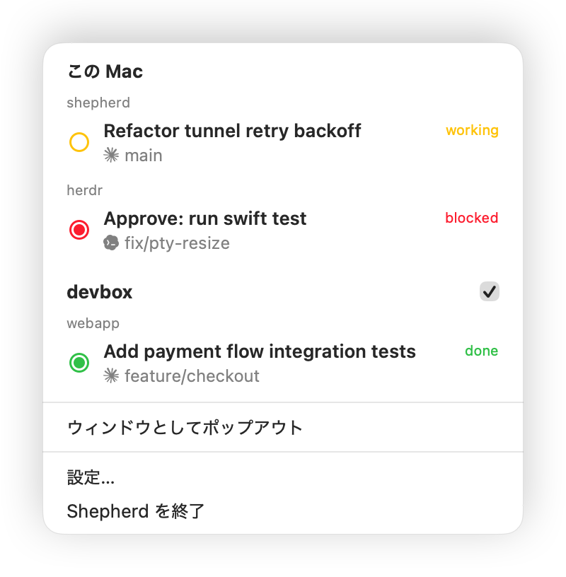

<div align="center">
  
  <h1>Shepherd</h1>
  <p>herdr 上のコーディングエージェントを監視する macOS メニューバーアプリ。</p>
  <p><a href="README.md">English README</a></p>
</div>

Shepherd は herdr (コーディングエージェント向けターミナルマルチプレクサ) に接続し、ローカルとリモートを横断してエージェントの状態をまとめて監視します。
入力待ちのエージェントがいると、メニューバーのアイコンが赤く変わります。

<p align="center">
  
</p>

## メニューバーアイコン

| 表示 | 意味 |
|------|------|
|  (点滅) | blocked。エージェントが入力を待っている |
|  (点滅) | done。完了したが結果をまだ見ていない |
|  | working。作業中 |
|  | すべて idle |
|  | herdr に接続できていない |

監視先が複数あるときは、対応が必要な状態を優先して表示します (blocked > done > working)。
done の表示は、herdr でその pane を見ると idle に戻ります。

## 通知

通知は既定で OFF です。
一般設定で有効にすると、agent が blocked または done になったとき、agent ごとに無音の macOS 通知を送ります。
起動、監視先の追加・再有効化、通知の再有効化後の最初の snapshot は基準状態として扱い、それ以降の変化から通知します。
一時的な切断では直前の状態を保持し、再接続後の状態と比較します。

通知の title はメニュー行と同じく、赤または緑の丸と現在の作業タイトルです。
2段目に監視先と workspace、本文に agent と branch を表示します。
通知は監視先ごとにまとまり、agent に対応が不要になると消えます。
ローカルの通知をクリックすると herdr の pane に移動し、リモートの通知ではポップアウトウィンドウ内の agent を表示します。

## エージェントへの移動

メニューバーのアイコンをクリックすると、監視先と workspace ごとにエージェントが今の作業タイトルつきで並びます。
ローカルのエージェントはクリックするとその pane に移動でき、ターミナルが前面に出ます。
リモートの行は監視専用です。

前面化するターミナルの既定は Ghostty です。
別のターミナルを使う場合は、次のように設定します。

```sh
defaults write io.github.cryks.shepherd TerminalBundleID <バンドル ID>
```

## ポップアウトウィンドウ

ドロップダウンは外側をクリックすると閉じます。
一覧を表示したままにしたいときは、メニューの「ウィンドウとしてポップアウト」で同じ一覧を通常のウィンドウに切り離せます。

## リモートの監視

設定の「リモート」タブに SSH 接続先を追加すると、リモートで動くエージェントも同じ一覧とアイコンに表示されます。
接続先には `~/.ssh/config` の Host 名か `user@host` を使い、必要なら herdr のセッション名も指定します。
更新間隔は接続先ごとに選べます。

接続には macOS 標準の `ssh` を使うため、`ProxyJump` や認証方式など `~/.ssh/config` の設定がそのまま効きます。
パスワードや秘密鍵は保存せず、接続時に入力を求めることもありません。
リモート側に必要なのは動いている herdr だけで、Shepherd がインストールや再起動をすることはありません。

## 設定

- ログイン時に起動
- エージェントアイコンをカラーで表示 (既定はモノクロ)
- 対応が必要なときにメニューバーアイコンを点滅
- agent に対応が必要なときに macOS 通知を送信 (既定は OFF)
- この Mac のセクション見出しの変更・非表示
- 言語 (システム / English / 日本語)
- アップデートの確認 (自動 / 手動)
- リモート監視先の追加・編集と更新間隔
- リモートごとの非表示や監視の一時停止

## 動作要件

- macOS 15 以降
- socket protocol 16 の herdr (ローカルと監視対象の各リモート)

## インストール

```sh
brew install cryks/tap/shepherd
```

または [Releases](https://github.com/cryks/shepherd/releases) の zip を展開して `Shepherd.app` を `/Applications` に移してください。

## ビルド

Xcode プロジェクトはありません。
SwiftPM と Makefile だけで .app を組み立てます。

```sh
make app   # release ビルド + dist/Shepherd.app の組み立て (ad-hoc 署名)
make run   # make app してから開く
```

インストールするには、`dist/Shepherd.app` を `/Applications` に移してください。

## 開発

```sh
swift build
swift test
make icon   # Support/GenerateAppIcon.swift から .icns と README 用 PNG を再生成
```

Shepherd は herdr を polling して状態を取得します。
同期の設計は `Sources/Shepherd/Store.swift`、複数監視先の集約は `Sources/Shepherd/FleetStore.swift` の冒頭コメントに書いてあります。
