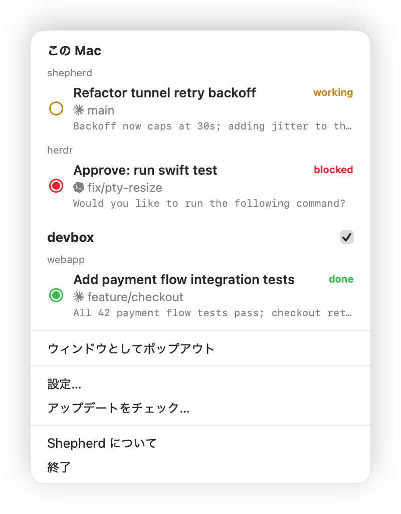

<div align="center">
  
  <h1>Shepherd</h1>
  <p>herdr 上のコーディングエージェントを監視する macOS メニューバーアプリ。</p>
  <p><a href="README.md">English README</a></p>
</div>

Shepherd は herdr (コーディングエージェント向けターミナルマルチプレクサ) に接続し、ローカルとリモートを横断してエージェントの状態をまとめて監視します。
入力待ちのエージェントがいると、メニューバーのアイコンが赤く変わります。

<p align="center">
  
</p>

## インストール

```sh
brew install cryks/tap/shepherd
```

または [Releases](https://github.com/cryks/shepherd/releases) の zip を展開して `Shepherd.app` を `/Applications` に移してください。

## メニューバーアイコン

| 表示 | 意味 |
|------|------|
|  (点滅) | blocked。エージェントが入力を待っている |
|  (点滅) | done。完了したが結果をまだ見ていない |
|  | working。作業中 |
|  | すべて idle |
|  | herdr に接続できていない |

## 通知

通知は既定で OFF です。
一般設定で有効にすると、agent が blocked または done になったときに macOS 通知を送ります。
通知をクリックするとそのエージェントへ移動します。

## エージェントへの移動

メニューバーのアイコンをクリックすると、監視先と workspace ごとにエージェントが今の作業タイトルつきで並びます。
ローカルのエージェントはクリックするとその pane に移動でき、ターミナルが前面に出ます。
リモートの行は監視専用です。

前面化するターミナルの既定は Ghostty です。
別のターミナルを使う場合は、次のように設定します。

```sh
defaults write io.github.cryks.shepherd TerminalBundleID <バンドル ID>
```

## 行の表示を変える

設定の「表示」タブで、エージェント 1 件の表示内容を決められます。
表示は何行でも増やせて、各行の左側と右側をそれぞれテンプレートとして書きます。

| 記法 | 意味 |
|---|---|
| `{name}` | 変数。定義のない名前は何も出ません。 |
| `{a\|b}` | 値のある方を先に採用します。 |
| `[…]` | 中の変数がすべて空なら、区切り文字ごと消えます。 |

herdr が報告する値は、herdr の綴りのまま `herdr.` 以下で参照できます。

```
{herdr.agent.terminal_title_stripped}   {herdr.agent.cwd}
{herdr.agent.agent}                     {herdr.agent.agent_status}
{herdr.workspace.label}                 {herdr.workspace.branch}
{herdr.workspace.worktree.repo_name}    {herdr.tab.label}
```

`herdr pane report-metadata` で自分の hook から送った値も同じ名前空間に入ります。
`{herdr.agent.tokens.model}` や `{herdr.workspace.tokens.jj_status}`、表示用の `{herdr.agent.title}`・`{herdr.agent.display_agent}`・`{herdr.agent.state_labels.working}` などです。

残りは Shepherd 側の変数です。

| 変数 | 値 |
|---|---|
| `{title}` | スピナーと Codex の `[ ! ] Action Required \|` を除いたターミナルタイトル |
| `{cwd_short}` | ホームを `~` にした作業ディレクトリ |
| `{cwd_name}` | 作業ディレクトリの末尾 |
| `{excerpt}` | 抜粋を有効にしているときの、エージェントの最新メッセージ |
| `{source}` | この Mac またはリモート名。リモートが表示されていない間は空 |
| `{agent_icon}` | ブランドマーク |
| `{status_emoji}` | 🔴 blocked / 🟢 done / 🟡 working / ⚪ idle |

既定の行は次のとおりです。

| 行 | 左 | 右 |
|---|---|---|
| 1 | `{title\|herdr.agent.agent}` | `{herdr.agent.agent_status}` |
| 2 | `{agent_icon\|herdr.agent.agent}[ {herdr.workspace.branch}]` | |
| 3 | `{excerpt}` | |

エージェント別の設定を作ると、そのエージェントの行はまるごと差し替わります。
通知の title・subtitle・body も同じテンプレートで書けます。ただし `{excerpt}` と `{agent_icon}` は何も出ません。

## ポップアウトウィンドウ

一覧を表示したままにしたいときは、メニューの「ウィンドウとしてポップアウト」を選びます。

## リモートの監視

設定の「リモート」タブに SSH 接続先を追加すると、リモートで動くエージェントも同じ一覧とアイコンに表示されます。
接続先には `~/.ssh/config` の Host 名か `user@host` を使い、必要なら herdr のセッション名も指定します。
更新間隔は接続先ごとに選べます。

接続には macOS 標準の `ssh` を使うため、`ProxyJump` や認証方式など `~/.ssh/config` の設定がそのまま効きます。
パスワードや秘密鍵は保存せず、接続時に入力を求めることもありません。
リモート側に必要なのは動いている herdr だけで、Shepherd がインストールや再起動をすることはありません。
ローカルで `herdr --remote` を起動しておく必要はありません。

## 設定

- ログイン時に起動
- 行と通知の表示内容の変更 (エージェント別の指定も可)
- エージェントアイコンをカラーで表示 (既定はモノクロ)
- 対応が必要なときにメニューバーアイコンを点滅
- agent に対応が必要なときに macOS 通知を送信 (既定は OFF)
- この Mac のセクション見出しの変更・非表示
- 言語 (システム / English / 日本語)
- アップデートの確認 (自動 / 手動)
- リモート監視先の追加・編集と更新間隔
- リモートごとの非表示や監視の一時停止

## 動作要件

- macOS 15 以降
- herdr (ローカルと監視対象の各リモート)

## ビルド

Xcode プロジェクトはありません。
SwiftPM と Makefile だけで .app を組み立てます。

```sh
make app   # release ビルド + dist/Shepherd.app の組み立て (ad-hoc 署名)
make run   # make app してから開く
```

インストールするには、`dist/Shepherd.app` を `/Applications` に移してください。

## 開発

```sh
swift build
swift test
make icon   # Support/GenerateAppIcon.swift から .icns と README 用 PNG を再生成
```

Shepherd は herdr を polling して状態を取得します。
同期の設計は `Sources/Shepherd/Store.swift`、複数監視先の集約は `Sources/Shepherd/FleetStore.swift` の冒頭コメントに書いてあります。
