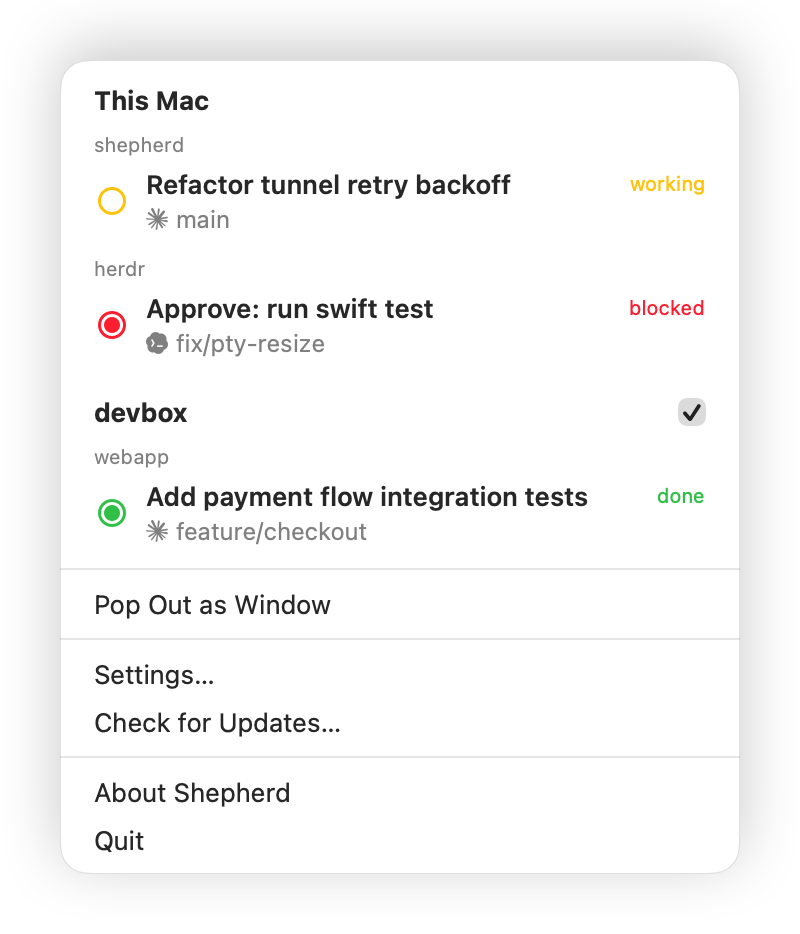

<div align="center">
  
  <h1>Shepherd</h1>
  <p>A macOS menu bar app that monitors your coding agents in herdr.</p>
  <p><a href="README-ja.md">日本語版 README はこちら</a></p>
</div>

Shepherd connects to herdr, a terminal multiplexer for coding agents, and watches your agents across local and remote hosts from the menu bar. When an agent starts waiting for your input, the icon turns red.

<p align="center">
  
</p>

## Install

```sh
brew install cryks/tap/shepherd
```

Or download the zip from [Releases](https://github.com/cryks/shepherd/releases) and move `Shepherd.app` into `/Applications`.

## The menu bar icon

| Icon | Meaning |
|------|---------|
|  (blinking) | An agent is **blocked**, waiting for your input |
|  (blinking) | An agent is **done**: finished, but the result hasn't been viewed |
|  | Agents are **working** |
|  | All agents are idle |
|  | Not connected to herdr |

## Notifications

Notifications are off by default. Enable them in General settings to get a macOS notification when an agent becomes blocked or done. Clicking one takes you to that agent.

## Jumping to an agent

Click the menu bar icon to list your agents, grouped by source and workspace, with their current task titles. Click a local agent to focus its pane in herdr and bring your terminal to the front. Remote agents are monitor-only.

The terminal to bring forward defaults to Ghostty. To use another one:

```sh
defaults write io.github.cryks.shepherd TerminalBundleID <bundle id>
```

## Pop-out window

To keep the list on screen, choose "Pop Out as Window" from the menu.

## Monitoring remote hosts

Add SSH destinations in the Remote settings tab and agents on those hosts appear in the same list and icon. A destination is a Host from `~/.ssh/config` or `user@host`, plus an optional herdr session name. Each destination has its own polling interval.

Connections use the standard macOS `ssh`, so `ProxyJump`, authentication methods, and host keys from your `~/.ssh/config` apply as usual. Shepherd stores no passwords or private keys and never prompts for input. All a remote host needs is a running herdr; Shepherd does not install or restart anything there. You do not need to run `herdr --remote` locally.

## Settings

- Launch at login
- Show agent brand marks in color (monochrome by default)
- Blink the menu bar icon when attention is needed
- Send macOS notifications when agents need attention (off by default)
- Rename or hide this Mac's section title
- Language: System, English, or 日本語
- Check for updates automatically or manually
- Add and edit remote sources and their polling intervals
- Hide or pause individual remotes

## Requirements

- macOS 15 or later
- herdr running on this Mac and every remote you monitor

## Building

There is no Xcode project. SwiftPM and a Makefile assemble the app bundle:

```sh
make app   # release build + assemble dist/Shepherd.app (ad-hoc signed)
make run   # make app, then open it
```

To install, move `dist/Shepherd.app` into `/Applications`.

## Development

```sh
swift build
swift test
make icon   # regenerate the .icns and the README PNG from Support/GenerateAppIcon.swift
```

Shepherd polls herdr for state. The synchronization design lives in the header comments of `Sources/Shepherd/Store.swift`, and fleet aggregation in `Sources/Shepherd/FleetStore.swift`.
